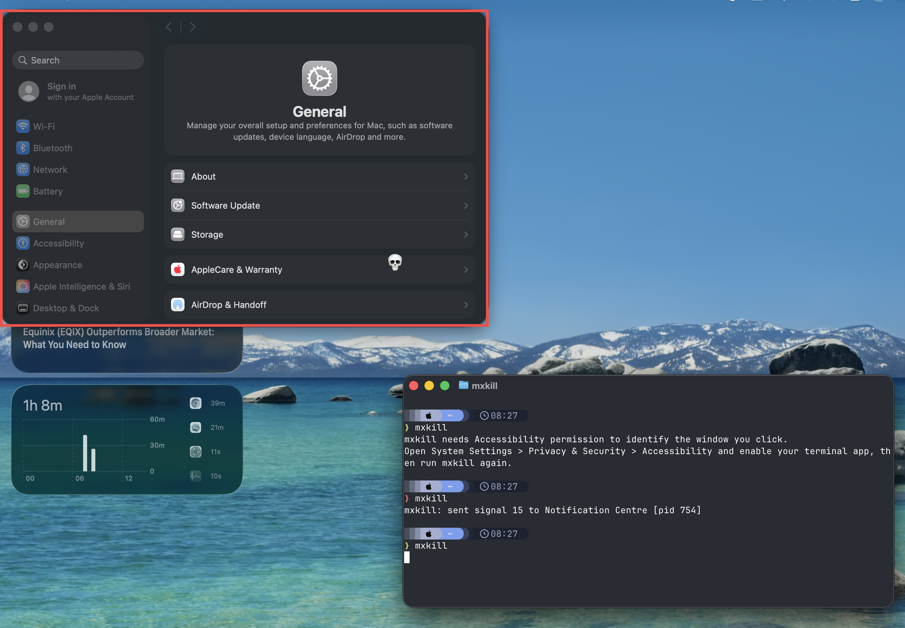

# mxkill

[](https://github.com/JakubSokolowski/mxkill/actions/workflows/ci.yml)

`mxkill` is a small macOS command-line tool inspired by Linux
[`xkill`](https://xorg.freedesktop.org/archive/current/doc/man/man1/xkill.1.xhtml).
Run it, click a window, and `mxkill` sends a signal to the process that owns that window.

While picking a window, `mxkill` highlights the window under the pointer and shows a destructive cursor marker.



## Inspiration

This started after Chrome crashed, then the macOS problem report window crashed too.
The report window would not close from the UI, Quit did not work, and Force Quit did not help.
The only way out was to search through the process list, find the right process, and kill it manually.

That took longer than it should have.
`mxkill` exists for that moment: run one command, click the stuck window, and move on.

## Requirements

- macOS 13 or newer
- Swift 5.9 or newer
- Accessibility permission for the terminal app that runs `mxkill`

## Build And Test

```sh
make test
make build
```

## Install

```sh
make install
```

By default this installs `mxkill` to `~/.local/bin/mxkill`.
Make sure `~/.local/bin` is in your `PATH`.

To install elsewhere:

```sh
make install PREFIX=/usr/local
```

## Usage

```sh
mxkill
```

Then click the window whose owning process should receive `SIGTERM`.

Options:

```sh
mxkill --force          # send SIGKILL instead of SIGTERM
mxkill --dry-run        # print the target without sending a signal
mxkill --timeout 5      # cancel if no window is picked within 5 seconds
mxkill --include-self   # allow targeting mxkill itself
```

Right-click or press Escape to cancel.

## Alternatives

- Force Quit dialog: press <kbd>Command</kbd> + <kbd>Option</kbd> + <kbd>Escape</kbd>
- `killall <process-name>`
- `pkill -f <pattern>`

## Uninstall

```sh
make uninstall
```
